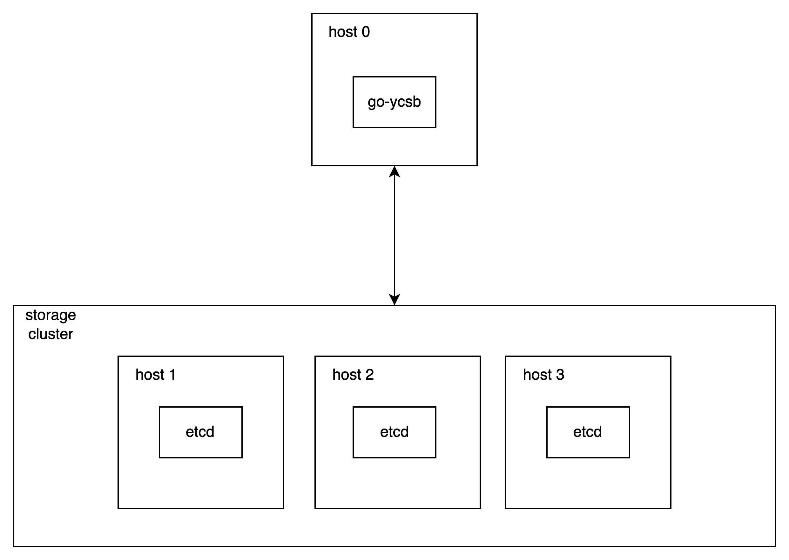
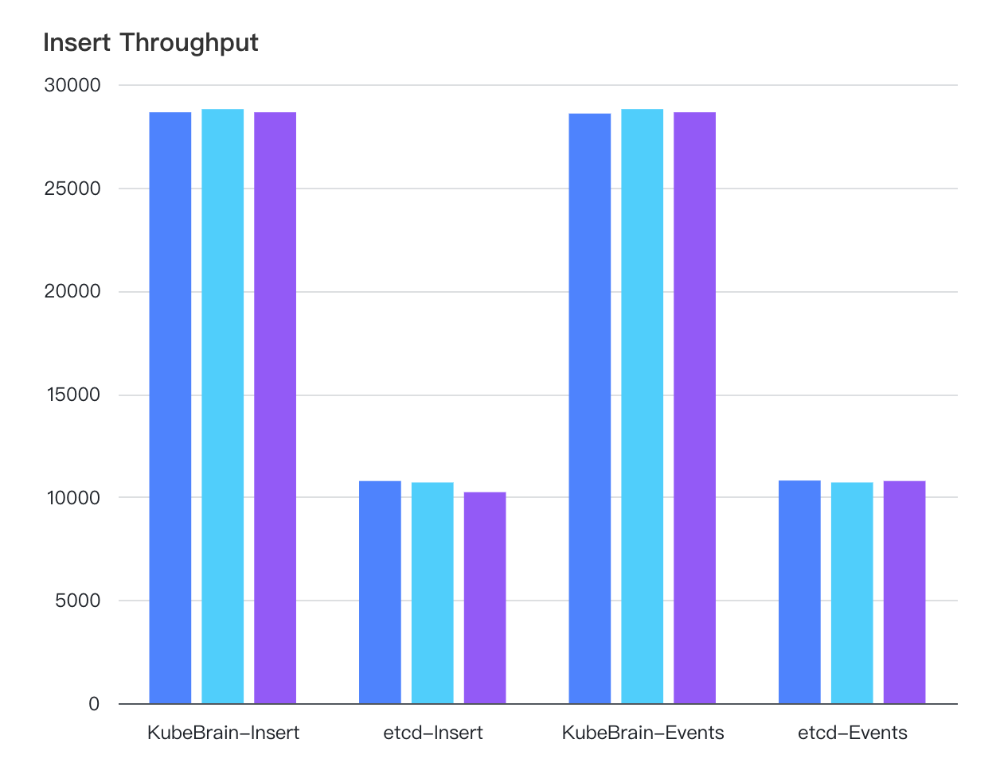
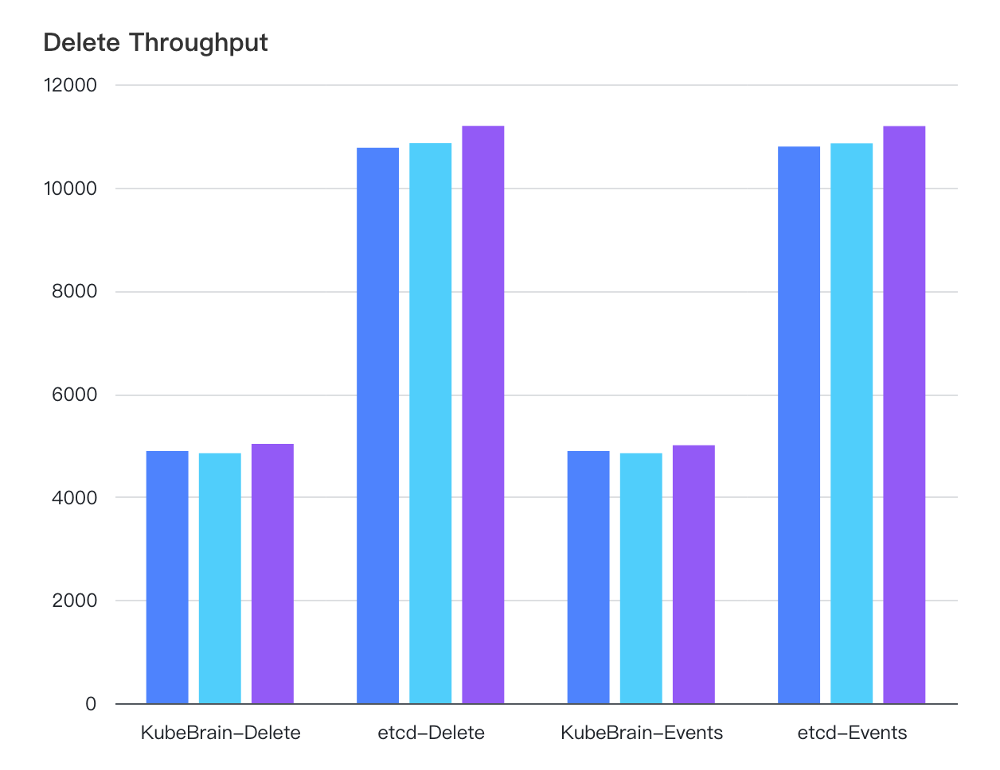

# KubeBrain on TiKV Benchmark

## Test Env

### Hardware

Tests are carried out using physical machines of the following

| Hardware | Properties                               |
|----------|------------------------------------------|
| CPU      | Intel(R) Xeon(R) Gold 5118 CPU @ 2.30GHz |
| MEM      | 187 GB                                   |
| DISK     | 2TB SSD                                  |
| NET      | 10 Gbps                                  |

### Deployment

#### etcd

3-node "etcd" cluster:

### KubeBrain on TiKV

Use 3-node "KubeBrain" cluster, "TiKV" uses "TiUP" to deploy "3 PD + 3 KV" cluster. "KubeBrain", "PD", "KV" are mixed
deployed.

## Benchmark

In the test case, the Key's length is fixed at 70 Bytes, generated with a "fixed prefix + random suffix". The Value is a
randomly generated 512 Bytes, with a concurrent output load of 300 etcd clients. Each test case is executed 3 times.

### Insert

[Detailed Data](./data/benchmark_insert.csv)

### Insert & Read

[Detailed Data](./data/benchmark_rw.csv)

### Delete

[Detailed Data](./data/benchmark_delete.csv)

## Conclusion

"KubeBrain on TiKV" can outperform "etcd" in read and write performance, while deletion performance needs to be further
optimized. However, the actual load of "Kubernetes" storage has a low percentage of deletion operations, and the overall
performance can be greater than "etcd". Moreover, "etcd" will have some performance degradation with usage, while "TiKV"
can be horizontally scaled to achieve better performance.