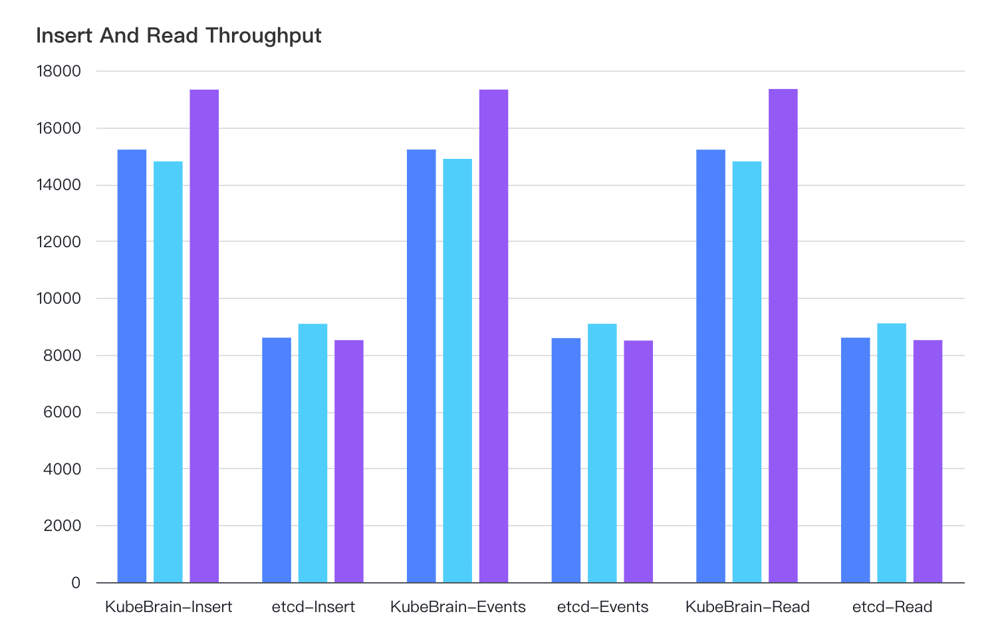

# KubeBrain on TiKV 性能测试

## 测试环境

### 测试机型

使用下述机型的物理机进行测试，

| 配置    | 属性                                       |
|-------|------------------------------------------|
| CPU   | Intel(R) Xeon(R) Gold 5118 CPU @ 2.30GHz |
| 内存    | 187 GB                                   |
| 磁盘    | 2TB SSD                                  |
| 网络带宽  | 10Gbps                                   |

### 部署方式

#### etcd

3节点etcd集群

### KubeBrain on TiKV

采用3节点KubeBrain集群，TiKV使用TiUP部署3 PD + 3 KV集群，KubeBrain、PD、KV混部

## 测试

测试用例中，Key长度固定为70Bytes，以固定前缀+随机后缀的方式生成，Value为随机生成的512 Bytes，以300个etcd client并发输出负载，每组测试用例执行3次

### 数据写入

[详细数据](./data/benchmark_insert.csv)

### 数据读写混合

[详细数据](./data/benchmark_rw.csv)

### 数据删除

[详细数据](./data/benchmark_delete.csv)

## 结论

KubeBrain on TiKV读写性能可以高于etcd，删除性能有待进一步优化。
但是Kubernetes存储的实际负载中删除操作比例较低，总体性能可以大于高于etcd，且etcd随着使用会有一定的性能衰减，而TiKV可以进行水平扩容，取得更好的性能表现。