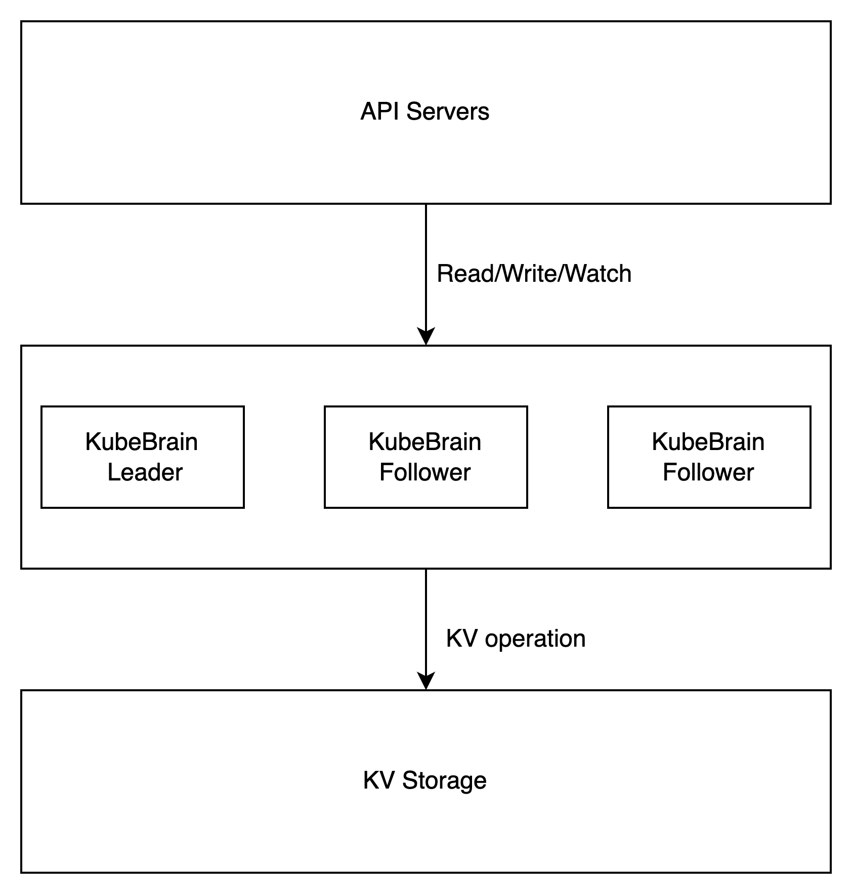
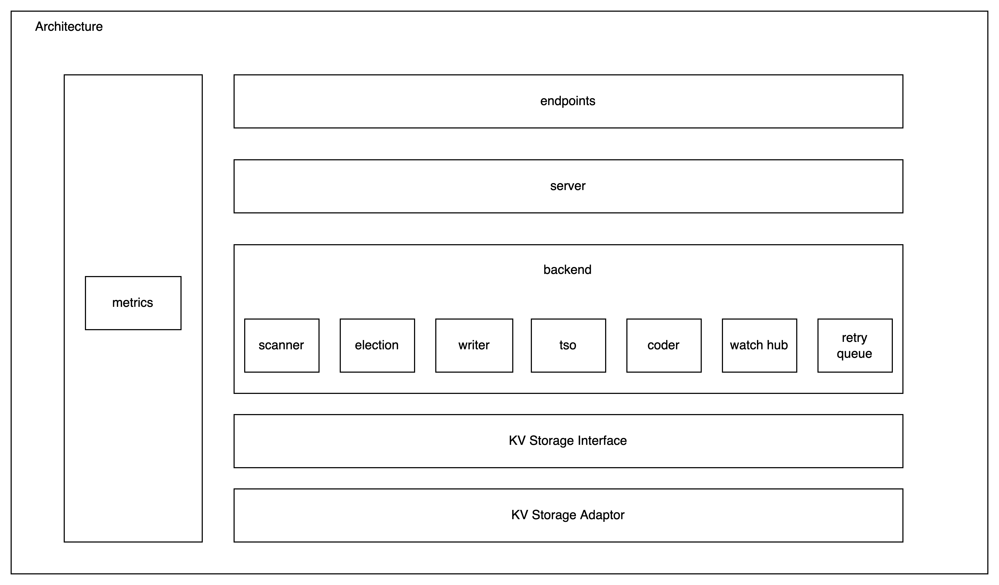
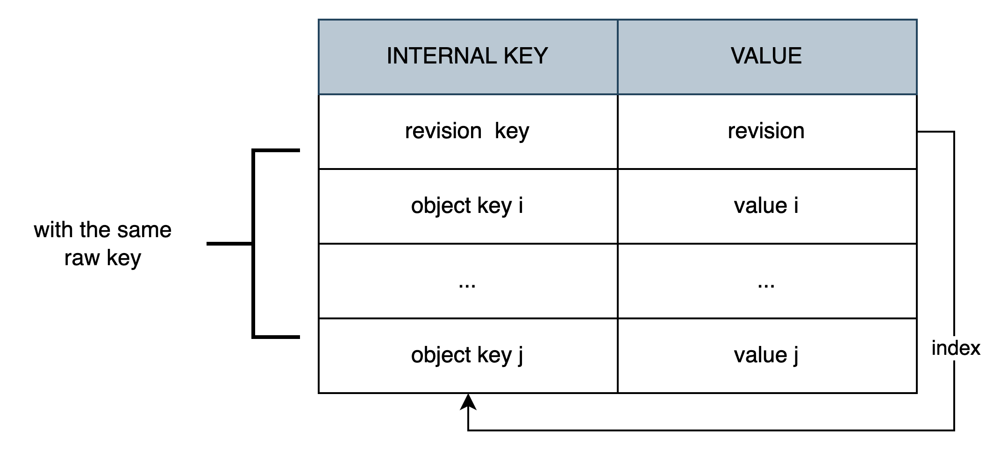
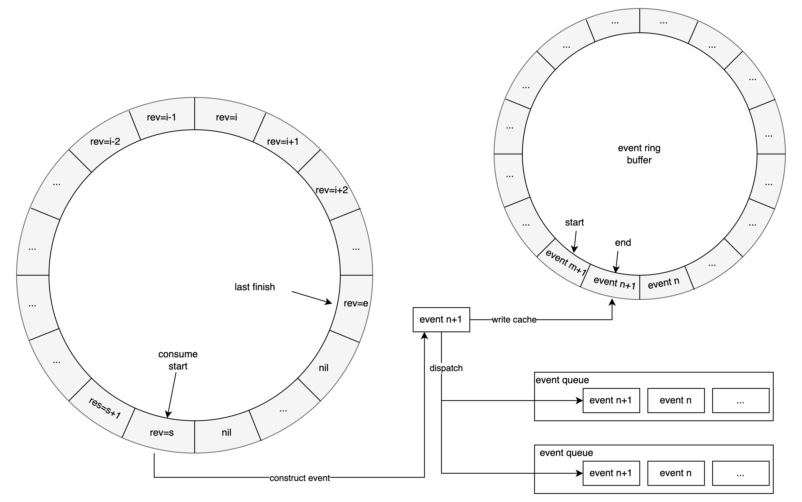
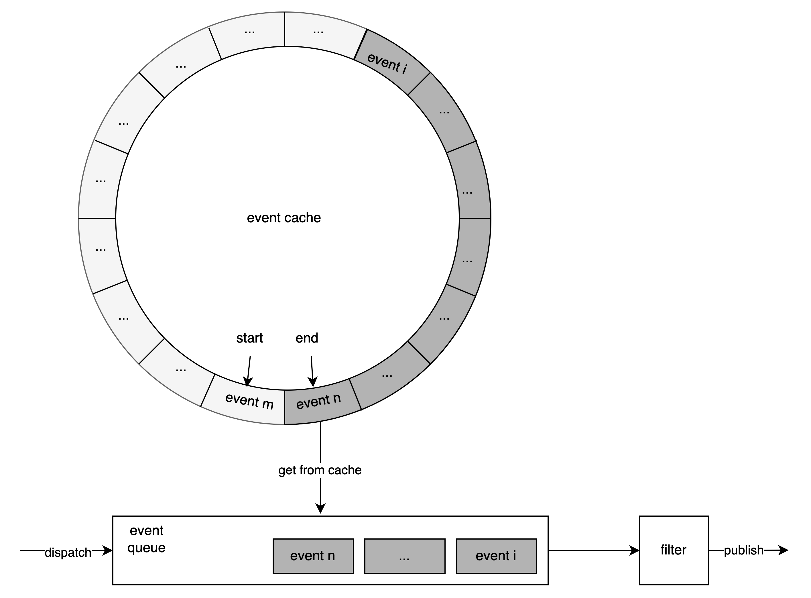

# Architecture

## Overview

KubeBrain abstracts the interface of the key-value database as a storage engine, and implements the storage interface of API Server on this basis to provide cluster metadata storage service for K8s.

<p align="center">
  
</p>


## Internal Struct


The project is generally divided into several parts:
- Endpoints: Listen to the port to expose the service to the public;
- Server: Logical encapsulation of RPC and HTTP;
- Backend: Logical encapsulation related to metadata storage:
    - Scanner：Encapsulating the logic associated with range finding and rubbish collection;
    - Election: Implementing ResourceLock based on the interface provided by the storage engine;
    - Creator: Responsible for writing data, built-in lease function to be added later;
    - TSO: The abstracted logical clock component currently relies on the implementation of the storage engine for initialization and will be decoupled later;
    - Coder: Transferring Raw Key from and to Internal Key;
    - Watch hub: Responsible for the generation, caching, and distribution of events;
    - Retry queue: Asynchronous retry queue. For the small number of operations that return non-deterministic errors, it guarantees final consistency through asynchronous retry corrections;
- KV Storage Interface: The abstracted KV storage engine interface;
- KV Storage Adaptor: Implementation of the KV storage engine for the storage interface, with built-in badger and TiKV implementation.

### Data Model

Similar to etcd, KubeBrain introduces revision for version management. KubeBrain will encode the raw key input by the API Server to two types of internal keys and write them to the storage engine index and data. 

For each key, the index revision key has only one record. The latest version number of the current raw key is also a lock, and each update operation to the raw key requires CAS on the index.

There are one or more data records of object key, and each data records the historical version of raw key and the value corresponding to the version. The encoding method of object Key is magic+raw_key+split_key+revision.
- `magic` is `\x57\xfb\x80\x8b`;
- `raw_key` is the key that is entered into the storage system by the actual API Server;
- `split_key` is `$`;
- `revision` is the logical sequence number of operations given by sequence number assigner of leader.

>According to the Kubernetes checksum rules, raw_key only contains lowercase letters, numbers, '-' and '.', so currently the split_key is the $.
  
In particular, the revision key is encoded in the same way as the object key, with the revision taking empty bytes of constant length 8. This encoding scheme ensures that the comparison relationship between pre- and post-encoding remains unchanged.


In the storage engine, all internal keys generated by the same raw key are stored within a continuous ranges.


This encoding method has the following advantages:
- Encoding is reversible, that is, the `InternalKey` can be obtained through `Encode(RawKey,Revision)`, and the Rawkey and Revision can be obtained through Decode(InternalKey);
- Through this mapping scheme, The Kubernetes ' object data is converted into ByteKV internal Key-Value data. Each object data has a unique index to record the latest version number, and the lock operation is realized through the index;
- This mapping scheme is very friendly for point search and range query. We can easily construct the key corresponding to a row or an index, or the key range corresponding to an adjacent row or  an adjacent index value
- Since the format of key is not monotonically incrementing, it avoids the hot write problem caused by the incrementing key in the storage engine.

### Sequence Number Assigner

KubeBrain uses revisions to manage versions of keys, each revision is a uint64 number. When assigning revisions, it is necessary to ensure that the revisions are monotonically incremented globally. Generating timestamps in a stand-alone database is simple, and using atomically self-incrementing integers can assign version numbers with high performance. 

To avoid single point problems, KubeBrain is a distributed, master-slave storage. Considering scenarios such as restarting and leader changing, we should ensure that the "global monotonic incrementing" is still valid. After starting, the sequence number assigner is on the master node and initializes by reading the logical clock of the storage engine.

At present, the sequence number assigner of KubeBrain only takes effect on the master node. When a node becomes the master node, it relies on the logical clock implemented by the storage engine and exposed the relative API, which guarantees strict increment, and performs the initialization of the sequence number assigner. After that, the master node assigns numbers for read and write operations. The write operation will be numbered in a continuous self-incrementing way.

### Write

Each write operation will be assigned a unique write ID by the sequence number assigner. When creating, updating, and deleting Kubernetes object data, it is necessary to operate the index and data corresponding to the object at the same time. Since the index and data are different key-value pairs in the underlying storage engine, it is necessary to use write transactions to ensure the atomicity of the update process, which requires at least snapshot isolation. 

At the same time, KubeBrain implements optimistic locking for concurrency control based on index. So in the process of write transactions, we first check the index revision key, update the index revision key after the check is done, and finally insert the data object key. The basic transaction flow is shown in the following code block：

```text
txn = NewTxn()
txn.Start()
index = txn.Get(revision_key)
if Check(index) {
   txn.Put(revision_key, write_revision_bytes)
   txn.Put(object_key, value)
}
txn.Commit()
```

> Storage engine optimization::
> - Logic push down: If the storage engine supports CAS push-down, index CAS can be pushed down to the storage engine for execution, reducing the number of RPCs from KubeBrain to the storage engine;
> - Transaction optimization: If the storage engine supports the key selection strategy when configuring partition splitting, all internal keys of the same raw key can fall into one partition through rule configuration, which can reduce the overhead of cross-sharding transactions for some storage engines.

### Query

#### PointQuery

Point query needs to specify the ReadRevision of the read operation. When the latest value needs to be read, set the readrevision to the maximum value MaxUint64, construct the iterator. The starting point is encode(RawKey, ReadRevision), traverse to encode ( RawKey, 0), and take the first one. The basic process can be represented by the following code block:

```text
txn.Start()
start = Encode(RawKey, ReadRevision)
end = Encode(RawKey, 0)
iter = txn.Scan(start, end)
iter.Next()
revision = extractRevision(iter.Key())
val = iter.Val()
txn.Commit()
```

> Storage engine optimization:
> - Most of the iterators of distributed KV databases have built-in asynchronous batch fetch processes in the SDK. If you can support the limit of iterator, you can reduce the amount of data that needs to be fetched, reduce read overhead and latency.
> - Since it is a read-only transaction, If the storage engine supports it, we can use snapshot reads instead.

#### RangeQuery

The range query needs to specify the ReadRevision of the read operation. For the RawKey interval [RawKeyStart, RawKeyEnd) of the range query , KubeBrain constructs the iterator of the storage engine for snapshot reading, and maps to the storage engine data interval through recoding.
- InternalKey's upper `boundInternalKeyStart` is
  `Encode(RawKeyStart, 0)`;
- InternalKey's lower `boundInternalKeyEnd` iis
  `Encode(RawKeyEnd, MaxRevision)`;
  Traverse all data in `[InternalKeyStart, InternalKeyEnd)` of the storage engine in order, and obtain `RawKey` and `Revision` through `Decode(InternalKey)`. For all `ObjectKey` with the same `RawKey`, take the largest `Revision` in the subset that satisfies the condition `Revision<=ReadRevision`, and return externally.
> Storage engine optimization:
> - If the storage engine exposes the interface of sharding query, then each sharding performs concurrent scanning to optimize efficiency.

## Event

For all change operations, a continuous and unique revision will be allocated by the TSO. After the change operation is written to the database, regardless of whether the write succeeds or fails, the changes will be submitted to the RingBuffer in memory in the order of revision from small to large. The components of the tuple include `(type，revision, key, value, result)`. 

In the tuple ring buffer, from the starting point to the end point, the revisions in all tuple data are strictly incremented, and the difference between adjacent revisions is 1.

The data of the above-mentioned ring buffer is consumed uniformly by the event generation component, and the tuple is cyclically fetched from the starting position of the ring buffer. There are three cases:
1. The fetched tuple is empty, which means that the corresponding version of the update operation has not been written to the ring array, so we keep retrying to fetch the tuple at that location;
2. If the fetched tuple is not empty and the corresponding update operation fails, f gives the component an asynchronous retry to read the tuple at the next location
3. If the fetched tuple is not empty and the corresponding update operation is successfully executed, construct the corresponding modification event, mark the TSO that the change operation corresponding to the revision has ended, and write the event cache in parallel and pass in the tail of all event queues created by listening.
   

In the metadata storage system, it is necessary to listen to the specified logical clock, that is, All modification events that occur after revision are specified for downstream cache updates and other operations, thereby ensuring the final consistency of the data of the entire system.

When registering for monitoring, you need to pass in the initial revision and filter parameters. The filter parameters include but are not limited to prefix filtering (only change events whose key contains the specified prefix are accepted)

1. When processing the listen registration request, create an event queue, and construct a filter according to the filter parameters;
2. Register the event queue in the event generation component to get the new events issued;
3. Pull all events from the event cache whose revision of the event is greater than or equal to the revision given to the event queue;
4. After the event is deduplicated, use the filter to filter according to the revision order from small to large;
5. Push filtered events to listeners outside the metadata storage system through the event flow.



### Async Retry

Most production environments use distributed key-value databases. Some databases may return some non-deterministic errors. That is, transactions return errors but may still write the results to the storage engine, such as timeouts, etc. For the storage engine used, we have the following assumptions:
- High availability: When the storage engine has problems, it can heal itself within a period of time.
- Linear consistency: Even if the read-write transaction Txn1 commits to return an indeterminate error, the result is read after waiting for a certain retry . If the result committed by Txn1 is not read, it means that the write transaction must fail.


Asynchronous retry acts as a special watcher that specifically checks for write errors, to ensure eventual consistency. Operations with uncertain results are pushed into the FIFO queue in the order of revision from small to large, and are consumed by a control loop, each loop performs the following operations:
1. Read the operation at the head of the queue;
2. Read and check the latest revision and value of the executed RawKey from the storage engine， there may be the following cases:
   - If the read operation fails, wait for a period of time and re-execute from 1;
   - Unlike the operation at head of retrying queue "Revision", there is no need to retry and continue from 4 onwards;
   - Same as the operation at head of retrying queue "Revision", you need to retry and continue from 3;
3. Perform a write operation to update the same value;
4. Pop the head of retrying queue.

### TTL

The TTL mechanism for specific types of resources is supported in KubeBrain, and the implementation is significantly different from etcd.
- There is no binding relationship between lease and key, determine whether there is TTL according to the pattern of the key, updating TTL requires updating Key Value;
- Does not support flexible TTL time settings, fixed timeout time;
- There is no guarantee that data will be recovered immediately after exceeding the TTL;
- Deleting expired keys does not throw any event.

There are two ways to implement TTL in KubeBrain:
- For storage engines that support Key, Value, and TTL, KubeBrain will sink TTL into the storage engine for implementation, which can reduce GC operations and read amplification.
- For storage engines that do not support Key, Value, and TTL, KubeBrain provides a built-in TTL mechanism.
  
The built-in TTL mechanism of KubeBrain exists as a component of the "Compact" mechanism. The KubeBrain's master node will regularly scan all the data in the storage engine, and delete the old  Revision data without destroying the consistency, so as to avoid the unlimited growth of the data in the storage engine.
- Before each start of "Compact", the KubeBrain's master node records the history of physical clock "TimeStamp" and logical clock "Revision", and saves them in memory as the query basis for whether revision times out
- When executing “Compact”, the history records of previous “Compact" records will be checked from memory. According to the latest history records, where the difference between the "TimeStamp" in the history and the current "TimeStamp" is greater than the fixed TTL, the corresponding "Revision" will be recorded as "TTLRevision". And the previous history records will be deleted. When scanning the key, for the key that conforms to a specific pattern:
    - For "Revision Key", if the "Revision" corresponding to the value is not greater than "TTLRevision", clean up;
    - For "Object Key", if the "Revision" obtained by "Decode (ObjectKey)" is not greater than "TTLRevision", clean up.
# FAQ

**Why not implement the event mechanism based on binlog？**

First of all, binlog is not a feature that all distributed kv databases must have. For distributed kv databases, enabling binlog will greatly increase write latency and reduces system throughput. In the K8s system, the event generated when the metadata is changed is used to incrementally update the cache. When the KubeBrain node crashes and the memory event is lost, the cache can be resynchronized through the list watch through the API Server, which can tolerate some event loss. Of course, subsequent projects will continue to optimize in this regard.
